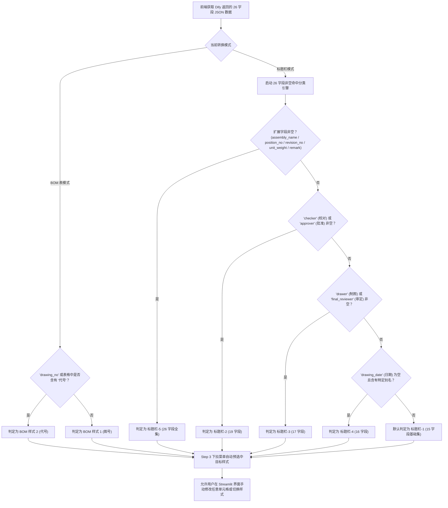

# [Implementation Plan] Streamlit + CAD WebView 网页端交互模块完整方案 (包含前端部分)

本方案旨在为现有的 `.zrx` (ZWCAD C++ 插件) 项目扩展开发一个基于 **Streamlit 前端 + Edge WebView2 交互窗口 + C++ 本地 HTTP 通信** 的高颜值、响应式网页端交互模块。方案高度复用 **`C:\Users\zwsoft\Desktop\transform\WebViewCAD`** 的架构，并根据 **`testdata\dify_results`** 实际返回的 26 个 JSON 字段结构与 **`项目内容.markdown`** 规范实现智能样式匹配。

---

## 1. 总体架构设计 (参照 `WebViewCAD` 项目规范)

项目采用三层解耦架构设计，完全复用 `WebViewCAD/ZwZrxProjectUseWebView2` 的 WebView2 宿主容器与集成方式：

```mermaid
graph TD
    A["CAD 用户输入命令 AI_Convert"] --> B["ZRX C++ 插件 (ZrxDlgApp1.zrx)"]
    B --> C["复用 WebViewCAD (ZwZrxProjectUseWebView2) 的 Edge WebView2 窗口"]
    B --> D["启动嵌入式 C++ HTTP 服务 (127.0.0.1:18088)"]
    C --> E["Streamlit 前端应用 (http://127.0.0.1:8501)"]
    
    subgraph Streamlit 4步状态机 (st.session_state)
        Step1["Step 1: 模式选择与识别初始化"]
        Step2["Step 2: 触发 CAD 框选与 Dify/OCR 提取"]
        Step3["Step 3: 26 字段结果确认与样式重映射"]
        Step4["Step 4: CAD 原生 ZcDbTable 表格回写生成"]
    end
    
    E --> Step1
    Step1 --> Step2
    Step2 --> Step3
    Step3 --> Step4
    
    Step2 <-->|POST /api/select_window & /api/run_dify| D
    Step4 <-->|POST /api/writeback_table| D
    D <-->|ZWCAD API / acedGetCorner / ZcDbTable| F["ZWCAD DWG 图纸文档"]
```

### 1.1 `WebViewCAD` 项目代码与架构复用策略
1. **WebView2 宿主窗口复用**：
   - 复用 `WebViewCAD/ZwZrxProjectUseWebView2` 中 `Microsoft.Web.WebView2` 控件的初始化、环境配置与 `WebView2Cache` 缓存目录管理。
   - 采用非模态/侧边栏控件机制，确保在 CAD 中加载网页 `http://127.0.0.1:8501` 的同时，不阻塞用户的 CAD 视口拉框（Step 2 选框）操作。
2. **静态资源与 DLL 依赖复用**：
   - 复用 `WebViewCAD/x64/Release/dist` 下的静态资源目录组织结构。

---

## 2. Dify 返回的 26 字段 JSON 结构与样式判断算法

根据 `C:\Users\zwsoft\Desktop\transform\testdata\dify_results\` 的实际返回样例，Dify 工作流输出固定包含以下 **26 个字段**（未识别到时对应值为空字符串 `""`）：

```json
{
  "enterprise_name": "企业名称",
  "drawing_name": "图样名称",
  "drawing_no": "图样代号",
  "product_or_material_mark": "产品名称或材料标记",
  "weight": "重量",
  "designer": "设计",
  "reviewer": "审核",
  "standardizer": "标准化",
  "process_engineer": "工艺",
  "drawing_date": "日期",
  "sheet_total": "共几页",
  "sheet_current": "第几页",
  "scale": "比例",
  "drawing_sheet_count": "图纸张数",
  "sheet_size": "图幅",
  "checker": "校对",
  "final_reviewer": "审定",
  "approver": "批准",
  "drawer": "制图",
  "assembly_name": "装配名称",
  "assembly_drawing_no": "装配图号",
  "unit_weight": "单重",
  "position_no": "位号",
  "quantity": "数量",
  "revision_no": "制修号",
  "remark": "备注"
}
```

---

### 2.1 基于 26 字段非空命中的样式分类规则

前端在接收到 Dify 返回的 26 字段 JSON 后，通过解析非空字段（Non-empty Key Hits）按以下优先级自动识别推荐的样式：



---

## 3. 核心分步引导流程 (Step-by-step Wizard)

Streamlit 前端使用 `st.session_state` 管理 4 步状态机：

### 界面顶栏（全局固定区域）
- **模式切换键**：`BOM表转换` 与 `标题栏转换` 选项卡。
- **步骤进度条**：`st.progress` 动态指示 Step 1 ~ Step 4。
- **Reset 按钮**：点击重置 `st.session_state` 状态机，清理临时数据并返回 Step 1。

---

### Step 1: 图纸表格/标题栏识别初始化
- **UI 展示**：显示功能简介，提供“开始识别”大按钮。
- **逻辑**：点击后触发任务初始化，自动递进至 **Step 2**。

---

### Step 2: CAD 框选交互与 OCR/Dify 流程
- **UI 展示**：提示用户：“请在 CAD 视图中框选表格/标题栏区域...”，提供“激活 CAD 框选”按钮。
- **逻辑**：
  1. Streamlit 调用 `POST http://127.0.0.1:18088/api/select_and_process`。
  2. ZRX 调用 `acedGetCorner` 让用户在 CAD 中框选图纸区域。
  3. ZRX 记录选框坐标（`minPt`, `maxPt`，保存**下界限 Bottom Boundary Y 坐标**）。
  4. 后台执行 OCR 识别与 Dify 工作流（复用现有的 `GetEntitysTableResult` 与 `RunDifyWorkflowForString` 逻辑）。
  5. 经过 **2.1 节的分类规则算法**，计算出推荐的样式类型。
  6. 返回识别到的 26 字段 JSON、推荐样式与选框坐标至 Streamlit，自动进入 **Step 3**。

---

### Step 3: 识别结果确认与样式映射
- **UI 展示**：
  - **双列表格编辑**（第一列：中文属性 Key/字段名，第二列：识别到的 Value）。通过 `st.data_editor` 允许用户双击修改值，纠正 OCR 误识别。
  - **标准字段/样式重映射下拉框**：
    - 根据 2.1 节算法自动预选中推荐样式，下拉框支持人工切换：
      - BOM 表模式：`样式 1 (图号)` / `样式 2 (代号)`。
      - 标题栏模式：`标题栏-1 (15字段)` / `标题栏-2 (19字段)` / `标题栏-3 (17字段)` / `标题栏-4 (16字段)` / `标题栏-5 (26字段)`。
  - **增删行功能**：允许补齐漏识别字段。
- **逻辑**：确认后点击“确认转换”，进入 **Step 4**。

---

### Step 4: CAD 表格/标题栏回写生成
- **UI 展示**：展示回写参数预览，提供“回写生成 CAD 表格”按钮。
- **逻辑**：
  1. Streamlit 发送 `POST http://127.0.0.1:18088/api/writeback_table`，带上修正后的 Key-Value 数据、选定样式与选框坐标。
  2. **ZRX C++ 核心回写算法**：
     - 根据所选样式生成原生 `ZcDbTable`。
     - **下界限对齐（Bottom Boundary Alignment）**：计算新建表格总高度 `totalHeight`，设置放置坐标点：
       $$\text{TablePosition.y} = \text{BBox.minY} + \text{TableTotalHeight}$$
       使新生成表格的**底边（Bottom Boundary）**与 Step 2 用户框选区域的下界限精准重合对齐。
  3. 刷新 DWG 图层视图，Streamlit 提示成功并支持重置。

---

## 4. 项目结构设计

```
transform/
├── webview_app/                        # [NEW] Python Streamlit 前端模块
│   ├── app.py                          # Streamlit 主入口 (4步 Wizard 状态机)
│   ├── components/
│   │   ├── header.py                   # 顶部模式切换、进度条与 Reset 按钮
│   │   ├── step1_init.py               # Step 1 视图
│   │   ├── step2_select.py             # Step 2 视图与 CAD 框选触发
│   │   ├── step3_editor.py             # Step 3 双列表格编辑与样式下拉选择
│   │   └── step4_writeback.py          # Step 4 回写确认与结果提示
│   ├── services/
│   │   ├── cad_bridge.py               # HTTP REST API 通信客户端
│   │   └── style_classifier.py         # 基于 26 字段非空命中的自动分类引擎
│   └── requirements.txt                # 依赖包 (streamlit, requests, pandas 等)
│
└── simple_zrx2025/ZrxDlgApp1/          # 参照 WebViewCAD/ZwZrxProjectUseWebView2 扩展
    ├── [MODIFY] rxentrypoint.cpp        # 注册 AI_CONVERT 命令，拉起 WebView2 窗口与 HTTP 服务
    ├── [NEW] ZrxHttpServer.cpp/.h      # 基于 cpp-httplib 的嵌入式 HTTP REST API 服务
    ├── [NEW] CadWebViewDialog.cpp/.h   # 复用 WebViewCAD 实现的 Edge WebView2 窗口容器
    ├── [NEW] CadTableWriter.cpp/.h     # CAD 原生 ZcDbTable 生成与底边精确对齐算法
    └── [MODIFY] ZrxDlgApp1.vcxproj     # 关联 WebView2 依赖与组件
```

---

## 5. Verification Plan（验证与测试计划）

### 5.1 本地与通信验证
1. 启动 `streamlit run webview_app/app.py`，验证网页 4 步流转、Reset 按钮、26 字段识别与 `st.data_editor` 表格修改功能。
2. 使用 Curl 验证 C++ HTTP API `http://127.0.0.1:18088/api/status` 的连通性。

### 5.2 CAD 集成联调
1. **命令触发**：在 ZWCAD 中加载 `.zrx` 插件，运行命令 `AI_Convert`，验证复用 `WebViewCAD` 封装的 WebView2 窗口成功拉起并展示 Streamlit 前端。
2. **完整 4 步流程验证**：
   - Step 1: 启动识别。
   - Step 2: 在 CAD 中框选图纸区域，验证选取坐标与 Dify 26 字段 JSON 返回（如 `02导轮轴套.json`）。
   - Step 3: 在 Streamlit 中检查自动归属的标题栏样式（如标题栏-1~5），修改 Key-Value，点击确认转换。
   - Step 4: 检查生成的原生 `ZcDbTable`，验证**表格底边**是否与 Step 2 框选的下界限精准重合对齐。
